# Mizani 使用說明書

> **舊版文件（僅留作研究紀錄）**：本頁的截圖與議價／成交流程已不在目前產品中。
> 現行流程請以 [`ARCHITECTURE.md`](ARCHITECTURE.md) 與專案根目錄 `README.md` 為準。

Mizani 是給肯亞–烏干達邊境（Busia）小商販和農夫用的按鍵機 App。它回答站在攤位前最常問的四件事：**現在行情多少、這一批值多少錢、對方開的價能不能接受、不賣他還能賣給誰。**

> 目前是原型：畫面上所有價格、匯率、買家需求都是示意資料，不是真實行情。你存的成交和回報只存在你這台裝置的瀏覽器裡。

截圖都是實際畫面（240×320，和按鍵機螢幕同尺寸）。

---

## 1. 怎麼打開

| 方式 | 怎麼做 |
| --- | --- |
| 線上版 | `https://dhggdhfnjd.github.io/mc_v2/`（要先在 GitHub repo 的 Settings → Pages 選 `gh-pages` 分支開啟，開啟前這個網址打不開） |
| 自己電腦 | `npm install` → `npm run dev` → 開 `http://localhost:3000` |
| Cloud Phone 模擬器／實機 | 在 [Cloud Phone 後台](https://www.cloudphone.tech/my) 登錄 widget（名稱、線上版網址、`public/icon-80.png`）後開啟 |

在電腦或智慧型手機上打開，會看到一支手機外框，下面有可以點的鍵盤；在按鍵機（或視窗寬度 330px 以下）會自動變成全螢幕，沒有外框。

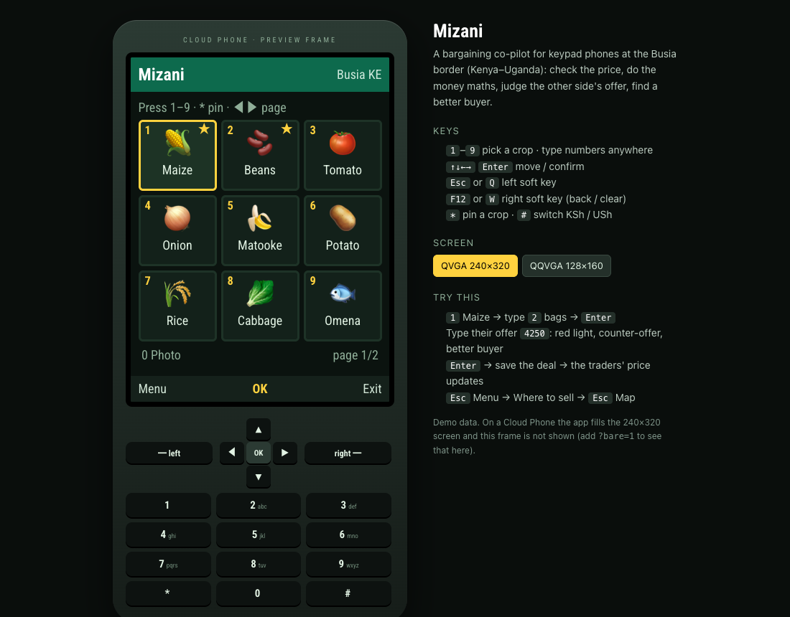

## 2. 按鍵

整個 App 只用按鍵機上有的鍵。電腦上用鍵盤，手機上點畫面下方的鍵盤。

| 按鍵機 | 電腦鍵盤 | 作用 |
| --- | --- | --- |
| 數字 `1`–`9` | 同左 | 首頁：直接選九宮格裡對應位置的品項。其他頁：**直接打數字就是輸入**，不用先選輸入框 |
| 方向鍵 | `↑ ↓ ← →` | 移動；很多頁的 `← →` 是「切換選項」（單位、買／賣、天數…），畫面上會畫 ◀ ▶ 提示 |
| 中間 OK 鍵 | `Enter` | 確認／下一步。畫面最下面中間黃字寫的就是它現在的作用 |
| 左軟鍵 | `Esc` 或 `Q` | 每一頁不同，看畫面左下角的字（Menu、Show card、Map…） |
| 右軟鍵 | `F12` 或 `W` | 看畫面右下角：輸入欄有數字時是 **Clear**（刪一位），沒有數字時是 **Back**（上一頁）。在首頁是 Exit |
| `*` | `*` | 首頁：把游標所在的品項釘選到最前面／取消釘選 |
| `#` | `#` | 看價頁、算錢頁：切換肯亞先令（KSh）／烏干達先令（USh）。在算錢頁切換會清掉已經打的數字，因為那是舊幣別的金額 |
| `0` | `0` | 首頁：開拍照辨識（裝置支援上傳照片時才有）。拍照頁：回九宮格 |

**記一個原則就好：畫面最下面那一列永遠告訴你三個鍵現在是什麼作用。**

## 3. 第一次使用

<table>
<tr>
<td width="250">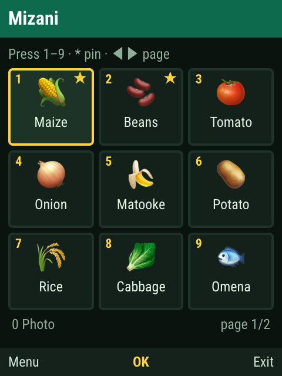</td>
<td>

**首頁：選品項。** 九宮格的位置對應數字鍵，按 `1` 就是玉米。右上有 ★ 的是釘選的品項，會排在最前面；用方向鍵移到某格按 `*` 可以釘選或取消。

品項不只九個：游標在最後一格時再按 `→`（或在第一格按 `←`）會翻頁，右下角顯示 `page 1/2`。

左下角 `0 Photo` 表示這台裝置支援上傳照片，按 `0` 可以拍照辨識（第 6 節）。

</td>
</tr>
<tr>
<td>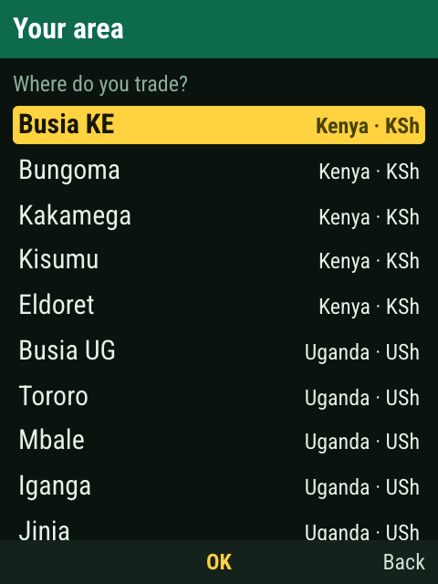</td>
<td>

**選地區：只有第一次會問。** 用 `↑ ↓` 選你做生意的市場，按 OK。之後 App 會記住，並顯示在每一頁右上角。

肯亞的市場用 KSh 顯示，烏干達的市場用 USh 顯示。想換地區：首頁按左軟鍵 Menu → `Your area`。

</td>
</tr>
</table>

## 4. 主流程：查價 → 算錢 → 議價 → 成交

這是 App 的核心，從頭到尾大約 20 次按鍵。

<table>
<tr>
<td width="250">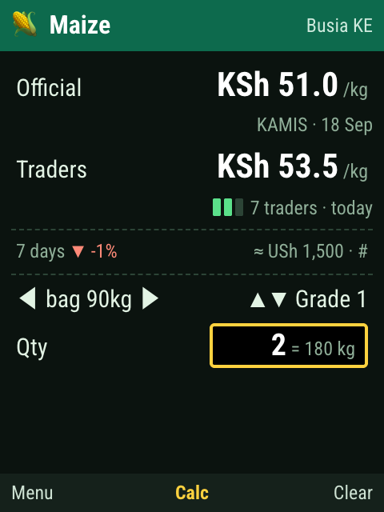</td>
<td>

### 4.1 看價

- **Official**：官方每公斤價格。下面一定會寫來源和日期；資料超過 3 天會出現黃色 `old` 標籤（烏干達目前只有月資料，所以會一直有）。
- **Traders**：其他商販回報的成交價中位數。前面的小格子是**信心格**：
  - 1 格：只有 3–4 人回報，或最新一筆已超過 4 天
  - 2 格：5–9 人
  - 3 格：10 人以上而且大家報的價很接近
  - 不到 3 人回報時不顯示數字，只寫 `Not enough reports yet`
- `7 days ▼ -1%`：官方價一週來的漲跌。右邊是換算成另一種先令的價格，按 `#` 可以整頁切換幣別。
- `◀ bag 90kg ▶`：按 `← →` 換單位（袋、公斤、gorogoro 小罐、debe 桶…，每種品項不同）。
- `▲▼ Grade 1`：按 `↑ ↓` 換品質等級，價格會跟著調整。
- **Qty**：直接打數字，例如 `2` 就是 2 袋，右邊會換算成公斤。打錯按右軟鍵 Clear。

打好數量按 OK（Calc）。

</td>
</tr>
<tr>
<td>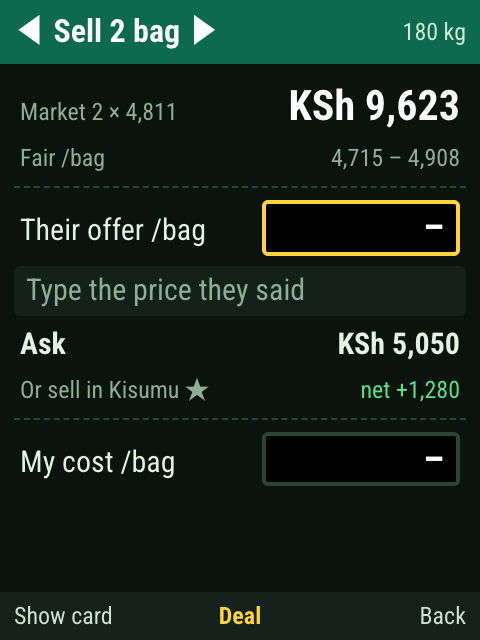</td>
<td>

### 4.2 算錢

- 第一行大字：**這一批照行情值多少錢**（2 袋 × 每袋 4,811 = KSh 9,623）。
- **Fair**：每袋的公平價格區間。
- **Ask**：建議你開口喊的價。對方還沒出價時，這是開場價（比公平區間上緣再高一點，留還價空間）。
- 標題列的 `◀ Sell ▶`：按 `← →` 切換「我要賣」和「我要買」。買的時候所有判斷會反過來（越便宜越好）。

</td>
</tr>
<tr>
<td>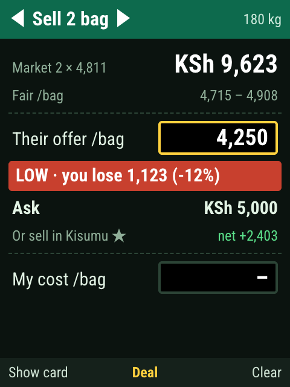</td>
<td>

### 4.3 議價：對方每喊一次價，你就打一次

直接用數字鍵打進對方開的**每袋**價格，畫面立刻回答四件事：

1. **能不能接受**：紅色 `LOW` 低於公平區間；黃色 `FAIR` 在區間內但低於行情；綠色 `GOOD` 等於或高於行情。（買的時候壞的那一邊叫 `HIGH`。）
2. **差多少錢**：`you lose 1,123` 是**整批**的錢，不是每袋。
3. **該還多少**：`Ask` 會跟著變。對方離行情越遠，你讓得越少；對方亂喊價，你一步不退；對方加到行情價，就在行情價成交。
4. **不賣他還能去哪**：`Or sell in Kisumu ★ net +2,403` 表示 Kisumu 有買家，扣掉運費後整批還多賺 2,403。有 ★ 的是真的有人貼出來的收購需求。

對方改口了就按右軟鍵 Clear 清掉重打。

</td>
</tr>
<tr>
<td>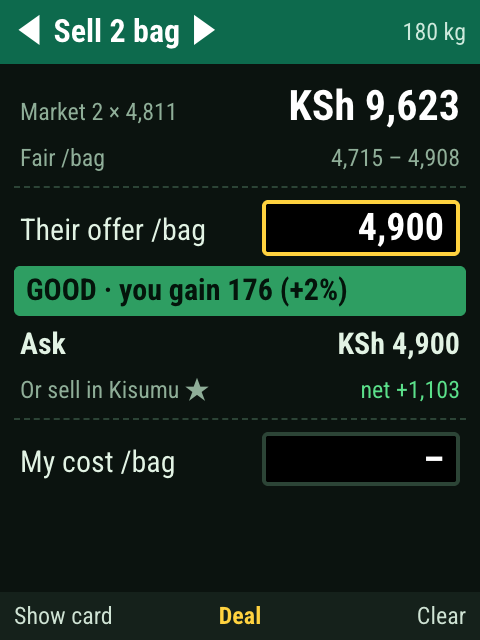</td>
<td>

對方加到 4,900：變綠燈，`Ask` 也降到 4,900，意思是可以成交了。

**My cost**：按 `↓` 移到這一欄，打進你每袋的成本（進貨＋運費＋規費）。之後 `Ask` 永遠不會低於成本；如果對方出價低於成本，紅色那行會多一句 `Below your cost`。

</td>
</tr>
<tr>
<td>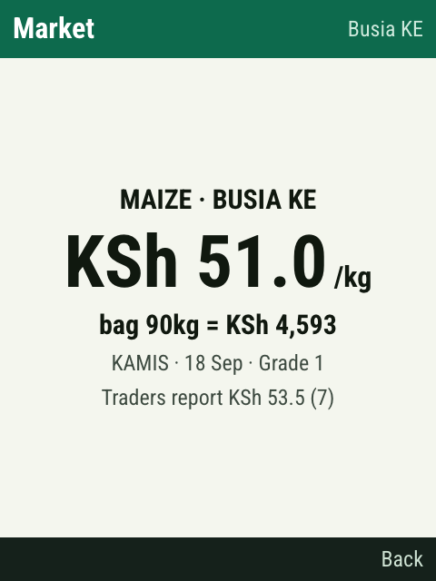</td>
<td>

### 4.4 把手機轉過去給對方看

在算錢頁按**左軟鍵 Show card**：白底大字的官方價格卡，有來源、日期、每袋換算價，下面一行是商販回報價。讓手機當第三方證人，比自己嘴上講有說服力。按右軟鍵回來。

</td>
</tr>
<tr>
<td>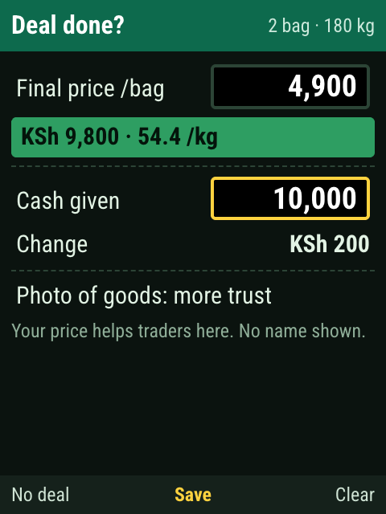</td>
<td>

### 4.5 成交了嗎？

在算錢頁按 OK（Deal）：

- **Final price**：已經幫你填好對方最後的出價。要改就直接打數字（第一個數字會取代原本的，不用先清）。下面的色塊是整批金額和換算的每公斤價。
- **Cash given**：按 `↓` 移過來，打對方給的現金，下面直接算出要**找多少錢**。
- **Photo of goods**（支援上傳的裝置才有）：再按 `↓` 到這一行按 OK，可以附一張貨的照片，這筆回報的可信度會比較高。
- OK = **Save**。沒談成就按左軟鍵 **No deal**，沒成交的出價一樣是有用的價格訊號。

</td>
</tr>
<tr>
<td>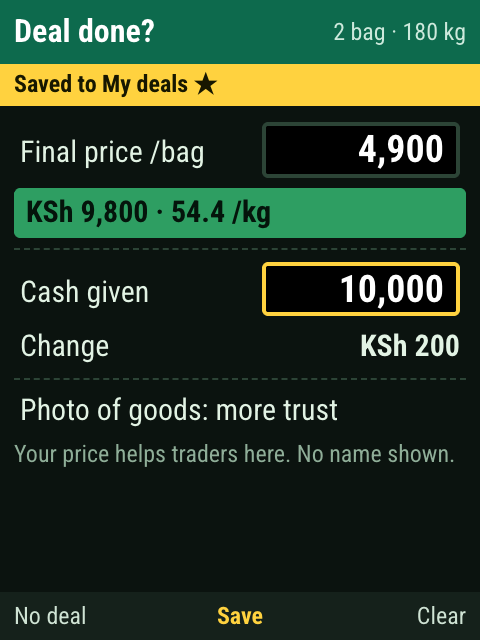  </td>
<td>

存完上方會顯示 `Saved to My deals ★`（上圖），然後自動回到看價頁（下圖）。注意 **Traders 那一行從 7 人變成 8 人**：你的成交價已經匿名算進去了（不會顯示名字）。同一筆也存進了你自己的帳本（第 9 節）。

</td>
</tr>
</table>

## 5. 選單

在**看價頁**按左軟鍵 Menu，會看到這個品項的選單；可以用 `↑ ↓`＋OK，也可以直接按前面的數字。

<table>
<tr>
<td width="250">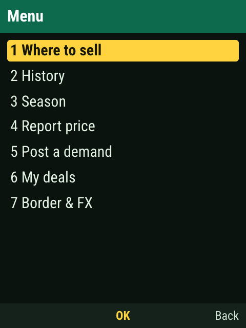</td>
<td width="250">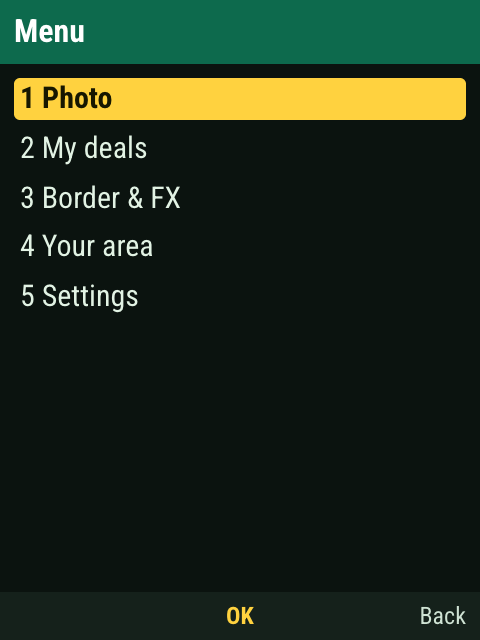</td>
<td>

左：看價頁的選單（針對目前這個品項）。

右：**首頁**按左軟鍵的選單（和品項無關的功能：拍照、我的帳本、匯率、換地區、設定）。

</td>
</tr>
</table>

## 6. 拍照辨識：不用找品項，拍一張就好

<table>
<tr>
<td width="250">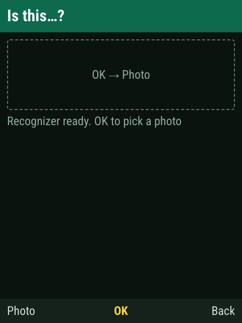</td>
<td>

首頁按 `0`（或 Menu → Photo）。

**第一次開會下載辨識模型（約 37 MB）**，畫面會顯示 `Loading recognizer (37 MB, once) 40%` 這樣的進度，行動網路可能要等一下；之後瀏覽器會把它快取起來，通常不用再下載。出現 `Recognizer ready` 後按 OK 選照片。在智慧型手機上會跳出「拍照／從相簿選」。

還沒載完就選了照片也沒關係，它會載完再辨識。

</td>
</tr>
<tr>
<td>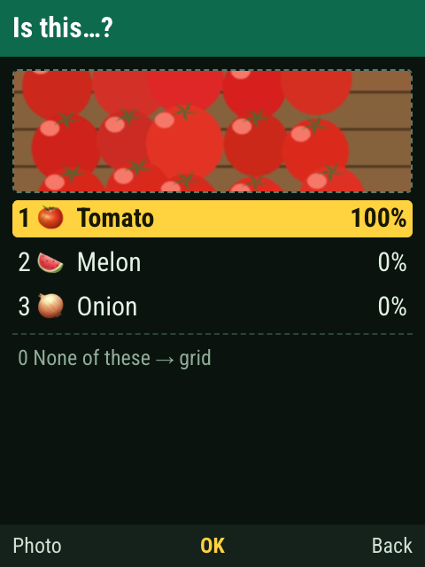</td>
<td>

**結果列出前三名和把握度。** 按 `1`、`2`、`3` 直接選（或 `↑ ↓`＋OK），就會進到那個品項的看價頁。

- 都不是：按 `0` 回九宮格自己選。
- 出現 `Not a crop I know`：它認為照片裡不是目錄裡的農產品（例如拍到人、房間、文件）。
- 想重拍：按左軟鍵 Photo。

**拍的時候**：靠近一點、讓農產品占滿畫面中間。外觀很像的東西（高粱／小米／豆子、熟香蕉／matooke）第一名可能會錯，但正確答案通常在前三名裡——這就是為什麼要列三個讓你按。

如果畫面下方出現 `Model unavailable: rough colour guess`，表示模型沒載成功，現在只是用顏色粗略猜，準確度很低。

</td>
</tr>
</table>

## 7. 去哪賣：需求看板和泡泡地圖

買家（磨坊、學校、餐館、批發商）可以貼「我在哪個市場、要多少、願意出多少」。賣家自己決定要不要送過去；App 不處理運送和付款。

<table>
<tr>
<td width="250">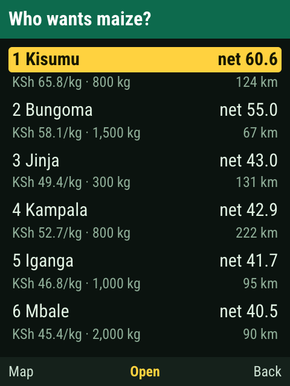</td>
<td>

看價頁 → Menu → `1 Where to sell`。

清單**依「扣掉運費後你實際拿到的每公斤價」（net）排序**，不是依對方開的價。第二行是對方的出價、要的數量、距離。

`↑ ↓` 選一筆按 OK 看買家；按左軟鍵 **Map** 看地圖。

</td>
</tr>
<tr>
<td>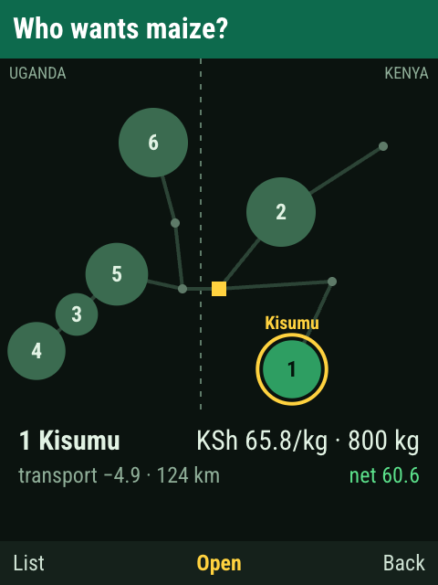  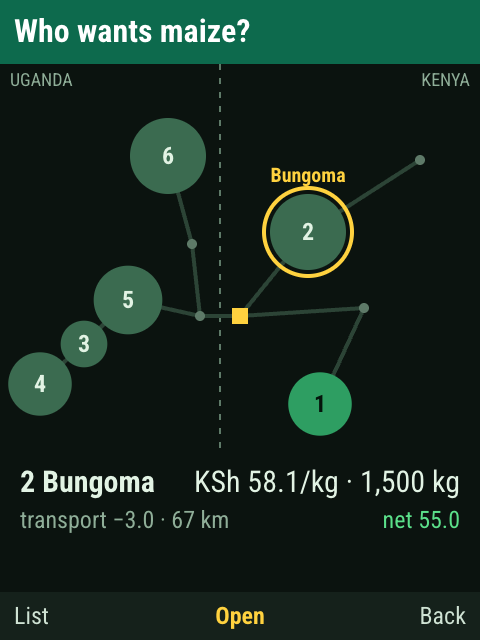</td>
<td>

**泡泡地圖。** 這是 Busia 走廊的示意圖：中間虛線是國界，左邊烏干達、右邊肯亞，黃色小方塊是你。

- 泡泡越大，那個市場要的量越多
- 泡泡上的數字是 net 排名（1 最划算）
- 亮綠色是接近最佳的選擇，暗綠色比較差
- 黃圈是目前選到的泡泡，下面兩行是它的出價、數量、運費、net

用方向鍵在泡泡之間跳（下圖：按 `↑` 從 Kisumu 跳到 Bungoma），或**直接按泡泡上的數字**。OK 看買家，左軟鍵 List 回清單。128×160 的小螢幕上地圖會縮得很小，建議直接用清單。

</td>
</tr>
<tr>
<td>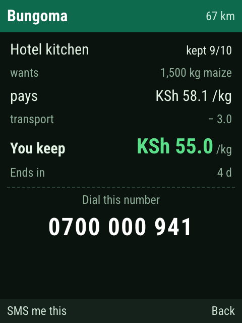</td>
<td>

**買家詳情。** `kept 9/10` 是這個買家過去 10 次約定裡有 9 次真的收貨。`You keep` 是扣掉運費後你每公斤實拿。`crosses border` 表示要過邊境。

下面的大字是電話，照著撥就好（目前的按鍵機不支援點一下就撥號）。左軟鍵 `SMS me this` 目前只是示範訊息，之後會改成由伺服器把這支電話用簡訊寄給你。

</td>
</tr>
<tr>
<td>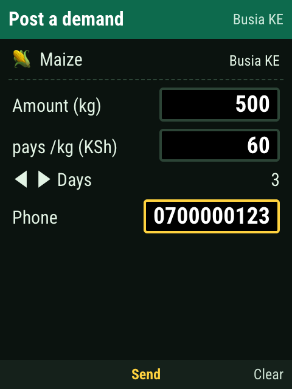</td>
<td>

**我是買家，我要貼需求。** 看價頁 → Menu → `5 Post a demand`。

依序填：要幾公斤 → 每公斤願意出多少 → 有效天數（`← →` 切 1／3／7 天）→ 電話（至少 9 碼）。每填完一欄按 OK 會跳到下一欄，全部填完 OK 變成 Send。

貼需求一定要留電話，因為別人會真的載貨過來。貼出去後會出現在需求清單裡，標 `(you)`。

</td>
</tr>
</table>

## 8. 走勢和季節：現在賣還是再等等

<table>
<tr>
<td width="250">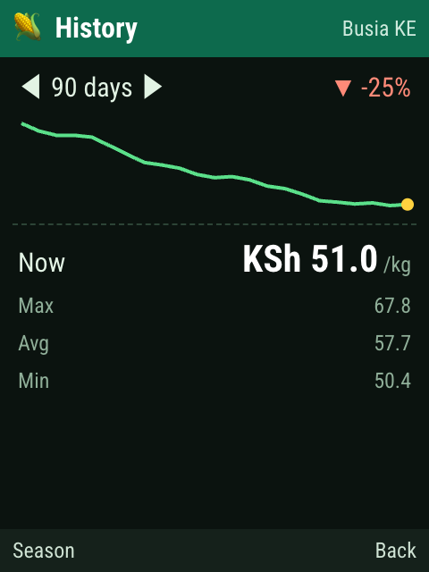</td>
<td>

**History**（Menu → `2`）。按 `← →` 切 30／90／365 天。右上角是這段期間的漲跌，黃點是今天，下面是最高、平均、最低。左軟鍵切到 Season。

</td>
</tr>
<tr>
<td>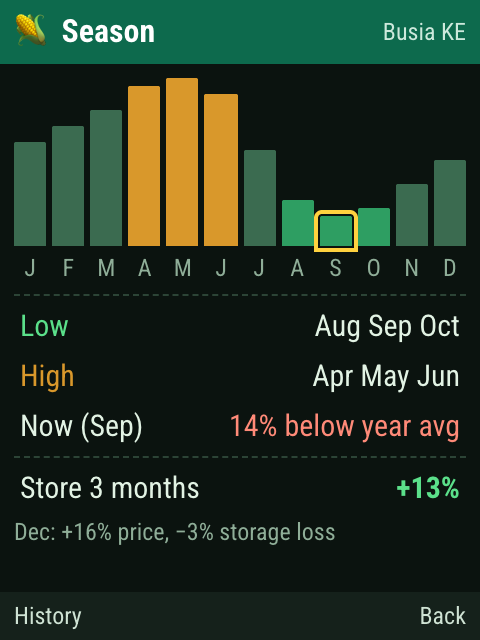</td>
<td>

**Season**（Menu → `3`）。像訂機票網站的低價月曆：12 根長條是 12 個月，綠色是便宜的月份、黃色是貴的月份，黃框是現在。

最下面 `Store 3 months +13%`：如果放三個月再賣，預期價格漲幅扣掉存放損耗後還剩多少。易腐的東西（番茄、葉菜）這個數字會是負的，意思是別放。

</td>
</tr>
</table>

## 9. 回報價格和我的帳本

<table>
<tr>
<td width="250">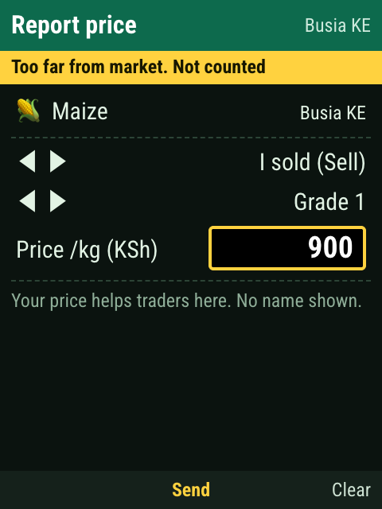</td>
<td>

**Report price**（Menu → `4`）。沒有走成交流程、但想回報今天的價格時用。`↑ ↓` 選列、`← →` 切換（我賣的／我買的、等級），數字直接打，OK 送出。

送出後上方會告訴你結果：

| 訊息 | 意思 |
| --- | --- |
| `Thank you! Counted` | 已算進商販回報價 |
| `Held until 2 others confirm` | 你的價和行情差超過 20%，先保留；48 小時內有另外 2 個人報出接近的價才會算進去 |
| `Too far from market. Not counted` | 低於官方價一半或高於兩倍，不採計（圖中報 900，行情約 51） |

同一台裝置對同一個品項和市場，只算最新的一筆，所以重複報不會把價格拉走。

</td>
</tr>
<tr>
<td>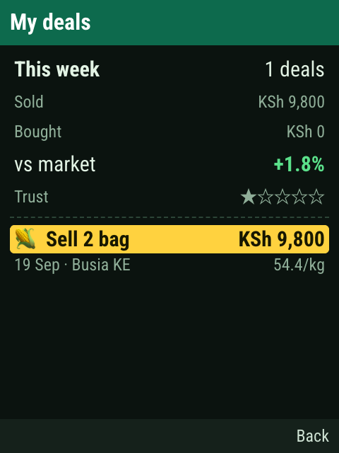</td>
<td>

**My deals**（任一選單裡都有）。上半部是本週小結：筆數、賣出和買進金額、`vs market`（你的成交價平均比當時行情好或差幾 %）、`Trust` 星星（回報被採計會慢慢增加，被拒收會扣）。下半部是每一筆紀錄，`↑ ↓` 捲動。

這些資料只存在這台裝置的瀏覽器裡；換裝置、清除瀏覽器資料、或在設定裡 Reset 都會消失。

</td>
</tr>
</table>

## 10. 邊境：匯率和免稅卡

<table>
<tr>
<td width="250">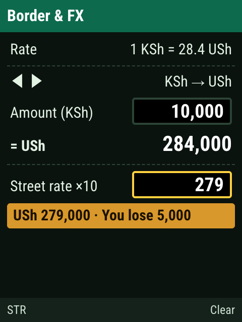</td>
<td>

**Border & FX**（任一選單裡都有）。

1. 第一列 `← →` 切換方向（KSh→USh 或反過來）。
2. `↓` 到 Amount，打金額，下面大字是照中間匯率應該換到多少。
3. `↓` 到 **Street rate ×10**，打換匯的人報給你的匯率，**不打小數點**：27.9 就打 `279`。

色塊會告訴你照這個匯率實際拿到多少、**少拿了多少**。圖中換 10,000 KSh，對方報 27.9，你少拿 5,000 USh。

</td>
</tr>
<tr>
<td>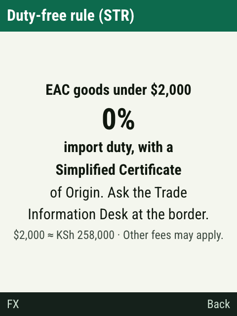</td>
<td>

按左軟鍵 **STR**：東非共同體的簡化貿易制度。原產於 EAC、單批價值低於 2,000 美元的貨，憑簡化原產地證明免進口關稅；邊境的 Trade Information Desk 可以協助開證明。這張卡可以直接給口岸人員看。

卡片寫的是規則，其他規費仍可能要繳，不是法律意見。

</td>
</tr>
</table>

## 11. 設定

<table>
<tr>
<td width="250">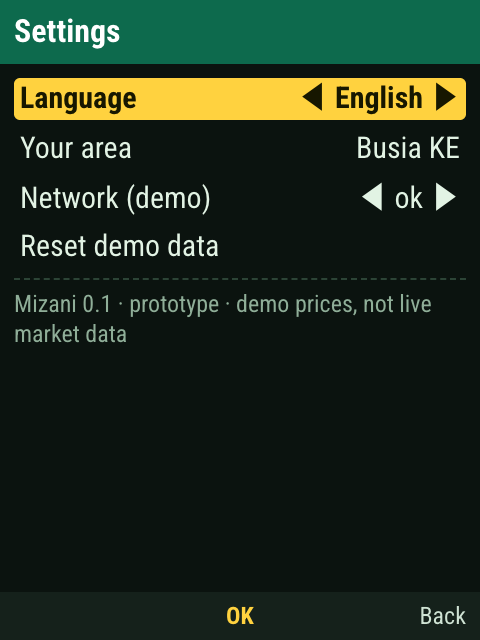</td>
<td width="250">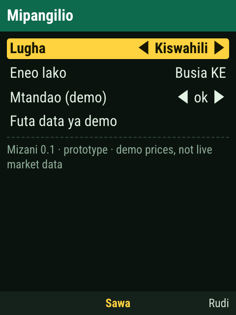</td>
<td>

首頁 → Menu → `5 Settings`。`↑ ↓` 選列，`← →` 或 OK 變更（Your area 和 Reset 要按 OK）。

- **Language**：English／Kiswahili（右圖）。
- **Your area**：換市場。
- **Network (demo)**：示範用。切到 `flaky`（時好時壞）或 `down`（斷線），可以看到 App 斷線時會顯示上次存下來的價格並標明日期，算錢功能照常可用。示範完記得切回 `ok`。
- **Reset demo data**：清掉這台裝置上你存的成交、回報、需求和信用星星。

</td>
</tr>
</table>

## 12. 小螢幕（128×160）

<table>
<tr>
<td width="140">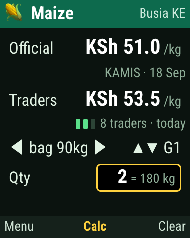</td>
<td width="140">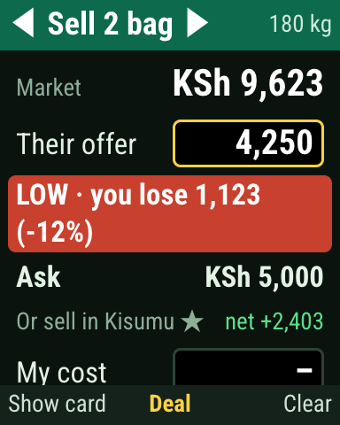</td>
<td>

最小的按鍵機螢幕只有 128×160。App 會自動省略分隔線、提示文字和次要的列，只留做決定需要的資訊。操作方式完全一樣。

在電腦上想看這個模式：點右邊的 `QQVGA 128×160` 按鈕，或網址加 `?bare=1&size=qq`。

</td>
</tr>
</table>

## 13. 兩分鐘示範腳本

給評審或新隊友看的最短路徑：

1. 首頁按 `1`（玉米）→ 打 `2`（2 袋）→ OK。
2. 「對方出 4,250」：打 `4250` → **紅燈**、整批少賺一千多、建議還價、Kisumu 有更好的買家。
3. 左軟鍵 **Show card** → 把手機轉給對方看 → 右軟鍵回來。
4. 「對方加到 4,900」：右軟鍵清掉、打 `4900` → **綠燈**。
5. OK → `↓` → 打 `10000` → 看到找零 → OK 存檔 → 回到看價頁，**回報人數 7 → 8**。
6. 左軟鍵 Menu → `1` → 左軟鍵 **Map** → 按 `2` 跳到第二名的泡泡 → OK 看買家電話。
7. 回首頁按 `0` → 選一張農產品照片 → 按 `1` 直接進看價頁。
8. （加分）Menu → `4`，報一個離譜的價 `900` → 被拒收，說明防灌水機制。

## 14. 常見問題

**手機上拍照沒辨識出來？**
先確認開的是有模型的版本：拍照頁第一次打開會出現 `Loading recognizer (37 MB, once)` 和百分比。沒有這行、或下面寫 `rough colour guess`，就是舊版或模型沒載成功。再來是第一次要等下載完；拍的時候靠近、讓農產品占滿中間；相似品項看前三名。

**為什麼 Traders 沒有數字？**
7 天內不到 3 個人回報就不顯示，避免拿一兩個人的價格誤導大家。你可以當第一個回報的人。

**我存的成交不見了？**
紀錄存在那台裝置的瀏覽器裡。換瀏覽器、無痕視窗、清除網站資料、或按了 Reset 都會消失。

**價格是真的嗎？**
不是。目前全部是示意資料，用來展示流程。接上真實資料來源是下一階段的工作（見 `docs/HANDOVER.md`）。

**按右軟鍵怎麼有時候是刪除、有時候是返回？**
目前游標所在的輸入欄裡有數字，它就是 Clear（一次刪一位）；刪到空了，再按就是 Back。看右下角的字就知道。

**電腦上按 F12 跳出開發者工具？**
改用 `W` 當右軟鍵、`Q` 當左軟鍵，作用完全一樣。
